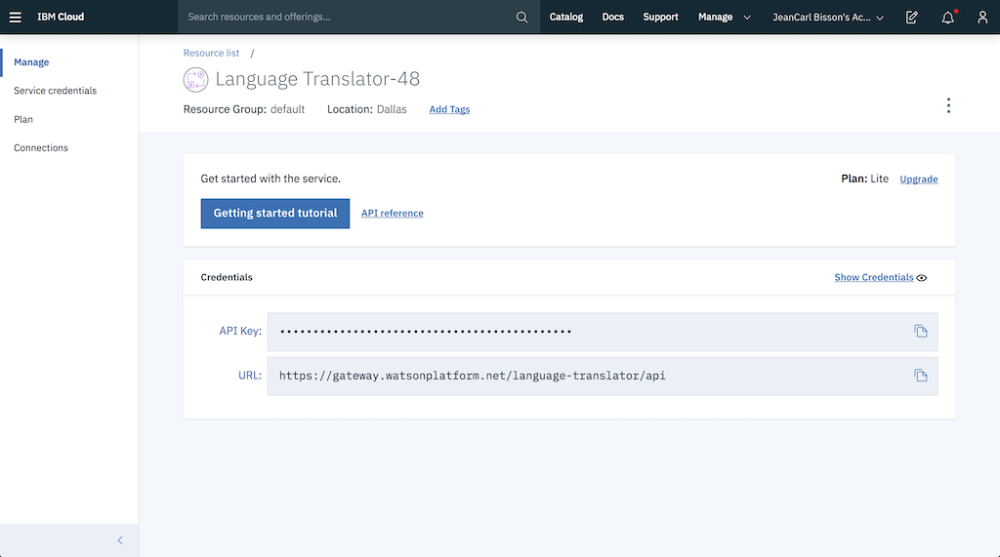

# Language Translator

TJBot can translate content with the help of the [Watson Language Translator Service](https://ibm.biz/catalog-language-translator).

## Create a Watson Language Translator service

1. [Sign up](https://ibm.biz/tjbot-challenge-signup) for an IBM Cloud account. If you already have an IBM Cloud account, sign in.

2. Click on the __Catalog__ link in the top right corner of the IBM Cloud dashboard.

	

3. Select the __Language Translator__ service tile under the __AI__ section of the catalog.

	
	
4. Click on __Create__ to create a service instance.

		

5. Click __Show Credentials__.

	
	
6. Copy the API Key credential into the `.env` file in the simulator.

	
	
```
LANGUAGE_TRANSLATOR_API_KEY=
```

## Command TJBot to Translate Content

For each step, REPLACE the placeholders `/* step ## */` with the suggested code. Do not keep any part of these placeholders in the final code! 

1. First, we create a TJBot object. Here's a template to start with. Copy the template into the `app.js` file in the simulator. 

	```
	var tj = new TJBot([], {}, {
	  /* step #2 */
	});
	
	/* step #3 */
	```
		
2. Configure the Watson Language Translator credentials TJBot should use to listen. Earlier we stored them into an environment variable. 

	```
	  language_translator: {
	    apikey: LANGUAGE_TRANSLATOR_API_KEY
	  }
	```
	
3. We now have a TJBot configured to translate content. Call the `translate` method with the content and source and destination language codes. When TJBot translates the text, a callback function will be passed the text TJBot translated. 

	```
	tj.translate("Hello", "en", "fr")
	  .then((response) => {
	  	console.log(response.translations[0].translation)
	  });
	```
	
4. Run the code by clicking on the play icon. Did TJBot translate the content and output the text into the console? You've completed this challenge.