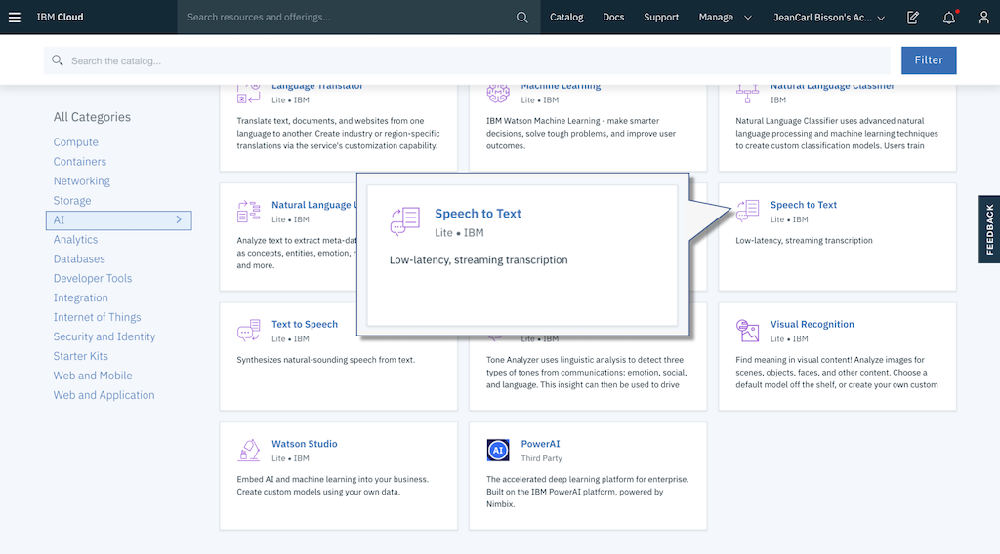

# Speech to Text

TJBot can listen using the microphone and with the help of the [Watson Speech to Text Service](https://ibm.biz/catalog-speech-to-text).

## Create a Watson Speech to Text service

1. Sign up for an IBM Cloud account at [bluemix.net](https://bluemix.net). If you already have an IBM Cloud account, sign in.

2. Click on the __Catalog__ link in the top right corner of the IBM Cloud dashboard.

3. Select the __Speech to Text__ service tile under the __Watson__ section of the catalog.

	
	
4. Click on __Create__ to create a service instance.	
5. Select __Service Credentials__ in the left sidebar.

	
	
6. Click on __View Credentials__ to display the credentials (note: if no credentials are listed, click on __New credential__ to create a new set). Copy the username and password credentials into the `.env` file in the simulator.

	
	
```
SPEECH_TO_TEXT_USERNAME=
SPEECH_TO_TEXT_PASSWORD=
```

## Command TJBot to Listen

For each step, REPLACE the placeholders `/* step ## */` with the suggested code. Do not keep any part of these placeholders in the final code! 

1. First, we create a TJBot object. Here's a template to start with. Copy the template into the `app.js` file in the simulator. 

	```
	var tj = new TJBot(
	  ["/* step #2 */"], 
	  {}, 
	  {
	    /* step #3 */
	  }
	);
	
	/* step #4 */
	```

2. Enable TJBot to use the microphone hardware by adding the string `"microphone"` as an array element.
	
	```
	var tj = new TJBot(
	  ["microphone"], 
	  {},
	...
	```
		
3. Configure the Watson Speech to Text credentials TJBot should use to listen. Earlier we stored them into an environment variable. 

	```
	    speech_to_text: {
	      username: process.env.SPEECH_TO_TEXT_USERNAME,
	      password: process.env.SPEECH_TO_TEXT_PASSWORD
	    }
	```
	
4. We now have a TJBot configured to listen. Call the `listen` method. When TJBot transcribes text, a callback function will be passed the text TJBot heard. Call stopListening after the first utterance is heard.

	```
	tj.listen((text) => {
	  console.log(text);
	  tj.stopListening();
	});
	```
	
5. Run the code by clicking on the play icon. Did TJBot listen and output the text into the console? You've completed this challenge.